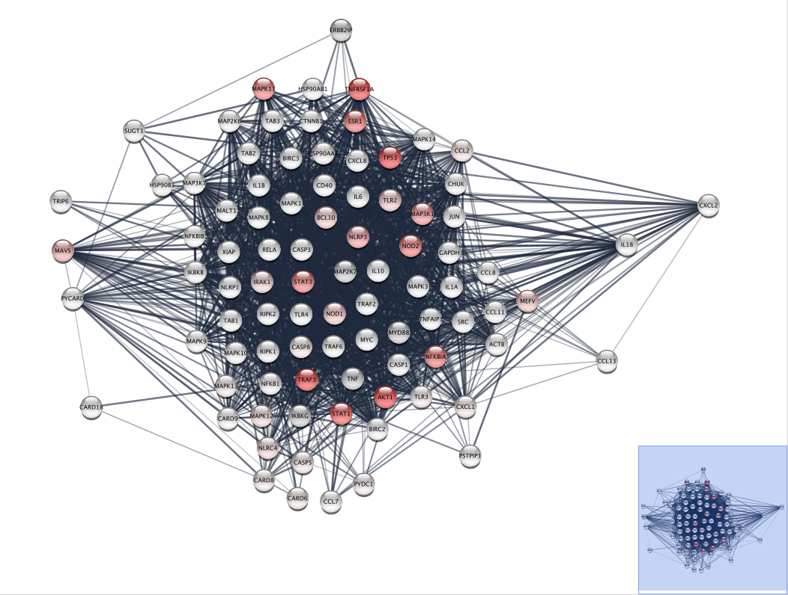

# Welcome to Network Biology!

Network biology is an exciting and growing field, with many applications and can be used to help solve complex biological problems. This website is designed to give a brief introduction to networks and their uses in biology, with a quiz at the end to test your new found knowledge!   

Contents:
1. What is a Network?
2. Biological Networks
3. STRING database
4. Network Analysis
5. Quiz

## 1. What is a Network?
Click or use your arrow keys to navigate through the network... 

<iframe src="https://prezi.com/p/8jav3kfelaxf/embed/" id="iframe_container" frameborder="0" webkitallowfullscreen="" mozallowfullscreen="" allowfullscreen="" allow="autoplay; fullscreen" height="563" width="1000"></iframe>

### Network Uses? 
Networks can be used to illustrate the relationships between a whole manner of objects. For example, the London tube map (Figure 1.1) is a network, with nodes representing stations and edges representing the tracks between them! This can therefore be used to help get from one station to the next in the shortest route possible. (Delays permitting of course...) 

Figure 1.1 H C Beck's diagrammatic London Tude Map (1933). An early representation of how a network can be used to help commuters around london. [1]

## 2. Biological Networks
Networks also have many different uses in biology. They can be used to represent interactions and relationships between groups and individual objects. Nodes can be different species of organism or molecules in a cell. Use the link and click through the slides to see some examples of biologcial networks. 

[Types of Biological Networks](slides.html)

## 3. STRING database 
STRING is a database than can be used to map predicted associations between proteins. These can be physical interactions, with experimental data confirming these interactions, or textmined from publications, were proteins are mentioned consistantly together in papers, generating a higher confidence that an interaction is taking place. This is all combinded into a confidence score that is represented on each edge. 

Use the [link](String/string.html) to query your own choice of protein, e.g NOD2 or TNF, and see what other protein interacts with it the most! 

You can also use the STRING website [here](https://string-db.org/cgi/input?sessionId=b8BYP1f5hIpw&input_page_active_form=single_identifier) to view more detailed information for different proteins. 

## 4. Network Analysis
Once you have generated a network with a set of candidate genes/proteins (remember genes code for proteins), you can carry out a variety of different analysis methods. These often involve identifying individually highly connected nodes (Hubs) or groups of highly connected nodes (Clusters). This information can then be used to identify key nodes or groups of nodes that could be functionally relevant. 

Other data can be integrated with these networks such as gene expression data or gene pathogencitiy scores to help identify disease causing proteins and what knock on effects that may have with other proteins, ultimately identifying the cause of disease. This is particularly useful in complex diseases such as Alzheimer’s, Parkinson’s and Crohn’s disease (Figure 4.1).

Figure 4.1. A network of proteins associated with Crohn's disease, with a patients pathogenicity score integrated. A higher score means a gene has a higher probability it is causing disease. (Higher Score is represented as a deeper red.)

## 5. Quiz

<iframe src="https://docs.google.com/forms/d/e/1FAIpQLSfkxPRAIUP8A0SjckPdXKXWHbbnRX18BZ6zpQKa-vmrJdADSw/viewform?embedded=true" width="640" height="566" frameborder="0" marginheight="0" marginwidth="0">Loading…</iframe>

### References 
[1] London Transport Museum. Avaliable at: https://www.ltmuseum.co.uk/collections/collections-online/maps/item/1999-321
[2] Matthew C. Perry - US Geological Survey (USGS). Avaliable at: https://pubs.usgs.gov/circ/circ1316/html/circ1316chap14.html
[3] EMBL-EBI. Avaliable at: https://www.ebi.ac.uk/training/online/courses/network-analysis-of-protein-interaction-data-an-introduction/types-of-biological-networks/
[4] KEGG Pathways. Avaliable at: https://www.genome.jp/pathway/hsa04910
